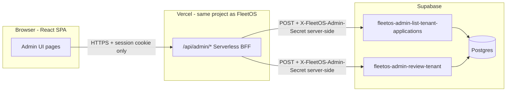
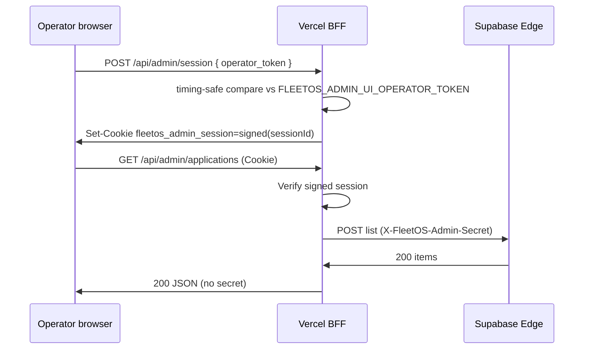

# FleetOS P1.2A — Admin UI for Application Approval (Technical Contract)

**Status:** Design only — **no implementation** in this deliverable  
**Date:** 2026-05-30  
**Depends on:** P1.1 validated (`fleetos-admin-list-tenant-applications`, `fleetos-admin-review-tenant`)  
**Parent:** `docs/architecture/FLEETOS_ADMIN_APPROVAL_P1_CONTRACT.md` (§15 P1.2 — Internal Admin UI)

---

## 1. Purpose

Define a **secure architecture** for an internal **Platform Admin UI** that lets FleetOS operators:

1. View the `pending_review` application queue.
2. Open application detail (tenant, onboarding metadata, submitter).
3. **Approve** or **reject** with `review_notes` and operator label.

**Hard constraints (non-negotiable):**

| Constraint | Reason |
|------------|--------|
| `FLEETOS_ADMIN_SECRET` **never** in React bundle / browser | Secret auth is equivalent to root platform write on tenants |
| Admin UI **must not** call Supabase Edge admin functions directly from the browser | CORS + network tab would expose secret if ever injected client-side |
| **No changes** in P1.2A to Edge, DB, or Auth Core | UI + BFF only (implementation phase follows this contract) |

---

## 2. Architecture overview



**Trust boundaries:**

| Zone | Trust level | Holds secrets? |
|------|-------------|----------------|
| Browser | Untrusted | **No** `FLEETOS_ADMIN_SECRET` |
| Vercel BFF (`/api/admin/*`) | Trusted server | **Yes** — `FLEETOS_ADMIN_SECRET`, operator gate secret |
| Supabase Edge (P1.1) | Trusted server | **Yes** — `service_role` (already) |

---

## 3. Decisions (summary)

| # | Question | **P1.2A decision** | Future (P1.2B+) |
|---|----------|-------------------|-----------------|
| 1 | Where does Admin UI live? | **Same FleetOS SPA**, route prefix `/internal/admin/*` | Optional separate deploy / subdomain |
| 2 | How to authenticate operator? | **BFF session** after `POST /api/admin/session` with server-only operator token | Auth Core `platform_role` JWT |
| 3 | How to hide admin secret? | **Vercel serverless BFF** injects `X-FleetOS-Admin-Secret` | Same |
| 4 | Frontend API surface? | `GET/POST /api/admin/applications`, `POST /api/admin/review-tenant` | Audit log, history |
| 5 | Edge invocation? | BFF `fetch` to `{SUPABASE_URL}/functions/v1/...` | — |
| 6 | Local dev? | `vercel dev` + `.env.local` (gitignored) | — |
| 7 | Production deploy? | Vercel env vars (server-only) | IP allowlist, SSO |

---

## 4. Where the Admin UI lives

### 4.1 Recommended: internal routes in FleetOS SPA

| Option | Pros | Cons | P1.2A |
|--------|------|------|-------|
| **A — `/internal/admin/*` in FleetOS** | One repo, shared design system, fast delivery | Must not confuse with tenant `/admin` dashboard | **Yes** |
| B — Separate subdomain (`admin.fleetos.app`) | Strong isolation, different CSP | Second deploy, CORS, duplicate UI shell | Defer |
| C — Separate repo / app | Maximum isolation | Higher ops cost | Defer |

**Route map (canonical):**

| Route | Purpose |
|-------|---------|
| `/internal/admin/applications` | Queue list (`pending_review`) |
| `/internal/admin/applications/:tenantId` | Detail + approve/reject actions |

**Naming collision avoidance:**

- Existing **tenant operational** UI uses paths like `/admin/dashboard`, `/admin/vehicles` (fleet operator inside an **approved** tenant).
- **Platform** admin uses **`/internal/admin`** prefix — clearly not tenant-scoped navigation.

### 4.2 Feature gating

| Gate | Mechanism |
|------|-----------|
| Build-time | `VITE_ENABLE_PLATFORM_ADMIN_UI=true` only on internal/preview Vercel projects |
| Runtime | BFF returns `401` without valid operator session — UI shows login, not queue |
| Router | React routes for `/internal/admin/*` registered only when flag enabled |

**Production applicant-facing deploy** may ship with flag `false` so routes are tree-shaken or unreachable.

### 4.3 Domain / hosting

| Environment | FleetOS SPA | BFF |
|-------------|-------------|-----|
| Local | `http://localhost:4200` (Vite) | `http://localhost:3000/api/admin/*` via `vercel dev` **or** Vite proxy to `3000` |
| Vercel Preview | `*.vercel.app` | Same origin `/api/admin/*` |
| Vercel Production | `app.fleetos.*` (canonical) | Same origin `/api/admin/*` |

**Same-origin BFF** avoids CORS between UI and `/api/admin` and keeps cookies `SameSite=Lax` simple.

---

## 5. Operator authentication

### 5.1 Problem

P1.1 Edge auth is **`X-FleetOS-Admin-Secret` only** — not suitable for browser operators.

Applicant auth (`codevertex_edge_jwt`) must **not** grant access to admin BFF (applicants could otherwise approve their own company if BFF only checked JWT).

### 5.2 P1.2A — BFF operator gate (recommended)

**Two secrets, two purposes:**

| Secret | Where | Purpose |
|--------|-------|---------|
| `FLEETOS_ADMIN_SECRET` | Vercel **server** env only | Supabase Edge admin calls (unchanged P1.1) |
| `FLEETOS_ADMIN_UI_OPERATOR_TOKEN` | Vercel **server** env only | Human operator proves identity to BFF (long random string) |

**Flow:**



**Session cookie properties:**

| Property | Value |
|----------|-------|
| Name | `fleetos_admin_session` |
| `HttpOnly` | `true` |
| `Secure` | `true` in production |
| `SameSite` | `Lax` |
| `Path` | `/api/admin` (or `/` if detail pages need it — prefer `/` for simplicity with `HttpOnly`) |
| Payload | Signed JWT or HMAC blob: `{ exp, reviewer_label? }` — **no** `FLEETOS_ADMIN_SECRET` inside |

**Session TTL:** 8h sliding or 12h fixed (config `ADMIN_UI_SESSION_TTL_SECONDS`, default `28800`).

**Logout:** `DELETE /api/admin/session` clears cookie.

### 5.3 Operator identity for audit

BFF forwards to Edge review body:

```json
{
  "reviewer_label": "ops@codevertex.cc"
}
```

| Source P1.2A | `reviewer_label` |
|--------------|------------------|
| Login body | Optional `reviewer_label` field stored in session |
| Default | `"platform_ui"` or operator email from login form |

Edge continues `reviewed_by_codevertex_user_id: null`, `reviewer_source: fleetos_admin_secret` until P1.2B JWT auth.

### 5.4 Alternatives considered (not P1.2A default)

| Approach | Verdict |
|----------|---------|
| Paste `FLEETOS_ADMIN_SECRET` in browser localStorage | **Rejected** — secret exfiltration via XSS/devtools |
| Call Edge from browser with secret in Vite `import.meta.env` | **Rejected** — bundled in client |
| Applicant `codevertex_edge_jwt` only | **Rejected** — wrong trust model |
| HTTP Basic on `/internal/admin` at CDN | Possible extra layer P1.2B; does not replace BFF |
| Auth Core `platform_role` JWT | **P1.2B** — BFF verifies RS256, maps `sub` → `reviewer_label` |

### 5.5 Future — Auth Core platform role (P1.2B)

| Step | Behavior |
|------|----------|
| Operator SSO | CodeVertex issues JWT with `platform_roles` includes `fleetos_platform_reviewer` |
| BFF | Verify JWT via JWKS (same pattern as `codevertex-edge-jwt.ts`) |
| Edge P1.2B | Dual auth: secret **or** platform JWT (per P1 contract §7.2) |
| Audit | `reviewed_by_codevertex_user_id` = JWT `sub` |

P1.2A ships operator token gate so UI is usable before Auth Core platform roles exist.

---

## 6. Keeping `FLEETOS_ADMIN_SECRET` out of the browser

### 6.1 Rules

| Rule | Enforcement |
|------|-------------|
| Never prefix `VITE_` on admin secrets | Code review + ESLint grep in CI optional |
| No `FLEETOS_ADMIN_SECRET` in `src/` | BFF lives under `api/` only |
| Browser calls only `/api/admin/*` | No `fetch` to `{SUPABASE_URL}/functions/v1/fleetos-admin-*` from `src/` |
| Network tab | Shows cookie + same-origin API only |

### 6.2 BFF → Edge request template (server-only)

```http
POST {SUPABASE_URL}/functions/v1/fleetos-admin-list-tenant-applications
X-FleetOS-Admin-Secret: {FLEETOS_ADMIN_SECRET}
apikey: {SUPABASE_ANON_KEY}
Content-Type: application/json
Origin: {FLEETOS_EDGE_ALLOWED_ORIGIN}
```

| Env (Vercel server) | Required | Notes |
|---------------------|----------|-------|
| `FLEETOS_ADMIN_SECRET` | Yes | Same value as Supabase Edge secret |
| `SUPABASE_URL` | Yes | Project URL |
| `SUPABASE_ANON_KEY` | Yes | Public anon key; safe on server |
| `FLEETOS_EDGE_ALLOWED_ORIGIN` | Yes | Must match Edge CORS allowlist (e.g. `https://app.fleetos.example` or dev `http://localhost:4200`) |

**Origin header:** Edge `corsHeadersForRequest` requires allowed `Origin`. BFF must send the **canonical app origin**, not the Vercel deployment URL, unless that URL is added to Edge CORS config.

### 6.3 Error passthrough

BFF maps Edge errors to client without leaking internals:

| Edge status | BFF → UI |
|-------------|----------|
| 401 `admin_unauthorized` | 502 `admin_backend_misconfigured` (log server-side; never tell browser "secret wrong") |
| 400 `validation_error` | 400 with message |
| 409 `review_decision_conflict` | 409 with message |
| 500 | 500 generic |

---

## 7. BFF API (frontend contract)

Base path: **`/api/admin`** (Vercel Serverless Functions under `api/admin/`).

All routes require valid **`fleetos_admin_session`** cookie except `POST /api/admin/session`.

### 7.1 `POST /api/admin/session` — operator login

**Request:**

```json
{
  "operator_token": "<FLEETOS_ADMIN_UI_OPERATOR_TOKEN from 1Password>",
  "reviewer_label": "ops@codevertex.cc"
}
```

**Success `200`:** `Set-Cookie: fleetos_admin_session=...`

**Errors:**

| Status | `error` |
|--------|---------|
| 401 | `operator_unauthorized` |
| 400 | `validation_error` |

### 7.2 `DELETE /api/admin/session` — logout

**Success `204`:** clears cookie.

### 7.3 `GET /api/admin/applications` — list queue

**Query parameters:**

| Param | Default | Maps to Edge body |
|-------|---------|-------------------|
| `status` | `pending_review` | `status` |
| `limit` | `50` | `limit` |
| `cursor` | — | `cursor` |
| `q` | — | `filters.q` or top-level `q` (match P1.1 parser) |
| `country_code` | — | `filters.country_code` / `country_code` |
| `sort` | `submitted_at_asc` | `sort` |

**Success `200`:** passthrough of Edge body (`ok`, `items`, `page`).

### 7.4 `POST /api/admin/applications` — list with body (optional)

Supports same filters as Edge POST for complex filters / future cursor payloads.

**Request body:** subset of P1 contract §9.2 (status, limit, cursor, sort, filters, `tenant_id`).

**Use when:** `tenant_id` detail fetch without REST path param.

### 7.5 `GET /api/admin/applications/:tenantId` — detail

**Behavior:** BFF calls Edge list with:

```json
{ "tenant_id": "<tenantId>", "status": "pending_review", "limit": 1 }
```

**Success `200`:**

```json
{
  "ok": true,
  "item": { ... } 
}
```

or `404` `application_not_found` if `items.length === 0`.

**No new Edge function** — aligns with P1.1 list + `tenant_id` filter.

### 7.6 `POST /api/admin/review-tenant` — approve / reject

**Request:**

```json
{
  "tenant_id": "uuid",
  "decision": "approve",
  "review_notes": "Verified documents",
  "reviewer_label": "ops@codevertex.cc"
}
```

| Field | Required |
|-------|----------|
| `tenant_id` | Yes |
| `decision` | Yes — `approve` \| `reject` |
| `review_notes` | Recommended; **required on reject** (P1.2A UI validation) |
| `reviewer_label` | Optional — BFF defaults from session if omitted |

**Success `200`:** passthrough Edge review response (`ok`, `decision`, `idempotent`, `tenant`, `access_preview`, …).

**Errors:** passthrough `409 review_decision_conflict`, `400`, etc.

### 7.7 `GET /api/admin/health` — optional

Returns `{ "ok": true, "edge_reachable": true }` without exposing secrets — for deploy smoke.

---

## 8. React UI (minimum viable)

### 8.1 Pages

| Page | Components |
|------|------------|
| **Login** (`/internal/admin/login`) | Token field (password input), optional reviewer label, submit → `POST /api/admin/session` |
| **Queue** (`/internal/admin/applications`) | Table/cards: company name, slug, country, submitted_at, pending_members count |
| **Detail** (`/internal/admin/applications/:tenantId`) | Card sections: tenant, onboarding (legal_name, tax_id, country), submitter membership, counts |

### 8.2 Actions (detail page)

| Control | Behavior |
|---------|----------|
| `review_notes` textarea | Required before Reject; optional before Approve |
| **Approve** | Confirm dialog → `POST /api/admin/review-tenant` `decision: approve` |
| **Reject** | Confirm dialog (strong copy) → `decision: reject` |
| Success toast | Show `idempotent: true` as "Already {decision}" |
| Error toast | Show `review_decision_conflict`, validation errors |

### 8.3 UX rules

| Rule | Detail |
|------|--------|
| No auto-refresh secret | Session cookie only |
| After approve/reject | Navigate back to queue or show read-only "Reviewed" state |
| Empty queue | Empty state + link to docs runbook |
| Loading / error | Standard spinner; 401 → redirect login |

### 8.4 Out of scope P1.2A UI

| Item | Phase |
|------|-------|
| Review history (`revoked` / past approved) | P1.2B |
| Email notifications | P1.2B |
| Bulk approve | P2 |
| Auth Core membership display | P1.2B |
| Mobile-optimized layout | Nice-to-have |

---

## 9. Project layout (implementation reference — not built in P1.2A)

```
fleetos-app/
  api/
    admin/
      session.ts          # POST login, DELETE logout
      applications.ts     # GET list, POST list body
      applications/
        [tenantId].ts     # GET detail
      review-tenant.ts    # POST review
  src/
    app/pages/internal/admin/
      AdminLoginPage.tsx
      ApplicationsQueuePage.tsx
      ApplicationDetailPage.tsx
    lib/services/
      fleetos-admin-bff.service.ts   # fetch /api/admin only
  vercel.json             # ensure /api/* not swallowed by SPA rewrite
```

**`fleetos-admin-bff.service.ts`:** only relative URLs (`/api/admin/...`), `credentials: 'include'`.

---

## 10. Vercel configuration

### 10.1 `vercel.json` interaction

Current SPA rewrite:

```json
{ "source": "/(.*)", "destination": "/index.html" }
```

**Requirement:** Vercel must register **`/api/*` Serverless Functions before SPA fallback**. Default Vercel behavior: filesystem `api/` routes take precedence. **Verify** after first deploy — if API 404s return `index.html`, add explicit:

```json
{
  "rewrites": [
    { "source": "/api/(.*)", "destination": "/api/$1" },
    { "source": "/(.*)", "destination": "/index.html" }
  ]
}
```

### 10.2 Environment variables

| Variable | Scope | Example |
|----------|-------|---------|
| `FLEETOS_ADMIN_SECRET` | Production, Preview (optional) | (Supabase-matched secret) |
| `FLEETOS_ADMIN_UI_OPERATOR_TOKEN` | Production, Preview | long random |
| `SUPABASE_URL` | Server | `https://xxx.supabase.co` |
| `SUPABASE_ANON_KEY` | Server | anon eyJ... |
| `FLEETOS_EDGE_ALLOWED_ORIGIN` | Server | `https://app.fleetos.example` |
| `ADMIN_UI_SESSION_SIGNING_SECRET` | Server | random 32+ bytes |
| `VITE_ENABLE_PLATFORM_ADMIN_UI` | Build | `true` / `false` |

**Never** set `FLEETOS_ADMIN_SECRET` or `FLEETOS_ADMIN_UI_OPERATOR_TOKEN` as `VITE_*`.

### 10.3 Deploy commands

```bash
# Link project (once)
vercel link

# Set production secrets (dashboard or CLI)
vercel env add FLEETOS_ADMIN_SECRET production
vercel env add FLEETOS_ADMIN_UI_OPERATOR_TOKEN production
# ... other server vars

# Deploy
vercel --prod
```

**Preview deployments:** use separate operator token or shared internal token; **do not** point preview BFF at production Supabase without explicit approval.

---

## 11. Local development (no secret in browser)

### 11.1 Recommended workflow

| Step | Command / action |
|------|------------------|
| 1 | Copy `.env.local.example` → `.env.local` (gitignored) with server vars |
| 2 | Terminal A: `npm run dev` → Vite `:4200` |
| 3 | Terminal B: `vercel dev --listen 3000` → BFF `:3000` |
| 4 | Vite proxy `vite.config.ts`: `/api` → `http://localhost:3000` |
| 5 | Open `http://localhost:4200/internal/admin/login` |
| 6 | Paste **operator token** (not admin secret) into login form |

**Operator token** lives in `.env.local` as `FLEETOS_ADMIN_UI_OPERATOR_TOKEN` — loaded by Vercel dev for `api/` only.

**`FLEETOS_ADMIN_SECRET`** only in `.env.local` for BFF — never opened in browser devtools Application tab if login form only accepts operator token.

### 11.2 curl against BFF (integration smoke)

```bash
# Login — capture cookie
curl -c cookies.txt -X POST http://localhost:3000/api/admin/session \
  -H "Content-Type: application/json" \
  -d '{"operator_token":"...","reviewer_label":"dev@local"}'

# List
curl -b cookies.txt "http://localhost:3000/api/admin/applications?limit=10"

# Review
curl -b cookies.txt -X POST http://localhost:3000/api/admin/review-tenant \
  -H "Content-Type: application/json" \
  -d '{"tenant_id":"<uuid>","decision":"approve","review_notes":"local smoke"}'
```

### 11.3 Without Vercel (fallback)

| Approach | Notes |
|----------|-------|
| Minimal Express sidecar | Same handlers; more maintenance — avoid unless `vercel dev` blocked |
| Direct curl to Edge | **Runbook only** — not UI testing |

---

## 12. Security controls & risks

### 12.1 Threat model

| Threat | Mitigation P1.2A |
|--------|------------------|
| Secret in JS bundle | BFF-only secret; CI grep `FLEETOS_ADMIN_SECRET` in `src/` |
| XSS steals admin secret | Secret not in DOM; HttpOnly session cookie |
| XSS steals session cookie | HttpOnly; short TTL; Content-Security-Policy (existing app) |
| Applicant accesses `/internal/admin` | BFF rejects without operator session; optional flag off in prod |
| Operator token leaked | Rotate `FLEETOS_ADMIN_UI_OPERATOR_TOKEN`; separate from Edge secret |
| CSRF on BFF POST | `SameSite=Lax` + optional `X-Requested-With` / double-submit token P1.2B |
| Brute force operator token | Rate limit `/api/admin/session` (Vercel middleware / Upstash) P1.2B |
| IDOR on `tenantId` | BFF only proxies to Edge; Edge uses service_role (platform scope) — acceptable for internal tool |
| Preview URL public | Disable admin flag on public preview; password-protect Vercel preview |

### 12.2 Risk register

| Risk | Impact | Likelihood | Mitigation |
|------|--------|------------|------------|
| Misconfigured `FLEETOS_EDGE_ALLOWED_ORIGIN` | BFF 403 from Edge | Medium | Document allowed origins; health check |
| SPA rewrite eats `/api` | Admin UI broken | Low | Deploy smoke `GET /api/admin/health` |
| Shared operator token for all ops | No per-user audit | High (P1.2A) | `reviewer_label` required in UI; P1.2B JWT |
| Operator approves wrong tenant | Wrong company live | Medium | Confirm dialog + show legal_name / tax_id |
| Session hijack on shared PC | Unauthorized review | Medium | Short TTL; logout button; future SSO |
| Preview env → prod Supabase | Data corruption | Low | Separate env vars per Vercel environment |
| Two tabs conflict review | 409 conflict | Low | Surface `review_decision_conflict` in UI |

### 12.3 Observability

| Event | Log (BFF server) |
|-------|------------------|
| `admin_ui_session_created` | `reviewer_label` (no tokens) |
| `admin_ui_list` | `count`, `duration_ms` |
| `admin_ui_review` | `tenant_id`, `decision`, `idempotent` |

No logging of `FLEETOS_ADMIN_SECRET`, operator token, or cookie value.

---

## 13. Testing plan (P1.2A implementation phase)

| Layer | Test |
|-------|------|
| BFF unit | Session sign/verify; 401 without cookie |
| BFF integration | Mock Edge; assert `X-FleetOS-Admin-Secret` header present server-side |
| UI component | Approve/reject buttons disabled without notes (reject) |
| E2E manual | Login → list → detail → approve → applicant `get-my-access` → `/app` |
| Security | Build `dist/` — grep for admin secret strings |
| Regression | Applicant routes unchanged; no new `VITE_` secrets |

---

## 14. Phased delivery

### P1.2A (this contract)

| Deliverable | Description |
|-------------|-------------|
| Vercel BFF | `/api/admin/*` |
| Admin UI | Login, queue, detail, approve/reject |
| Docs | `FLEETOS_ADMIN_UI_RUNBOOK.md` (implementation follow-up) |
| Env template | `.env.local.example` |

### P1.2B (hardening)

| Item | Description |
|------|-------------|
| Auth Core platform JWT | Replace operator token |
| Edge dual auth | Secret OR platform JWT |
| Rate limiting | Session + review |
| Review history UI | List reviewed tenants |
| IP allowlist | Vercel middleware |

---

## 15. Resolved decisions

| # | Question | Decision |
|---|----------|----------|
| 1 | Admin UI location | `/internal/admin/*` in FleetOS SPA |
| 2 | P1.2A operator auth | BFF session via `FLEETOS_ADMIN_UI_OPERATOR_TOKEN` |
| 3 | Hide Edge secret | Vercel serverless BFF only |
| 4 | Detail endpoint | `GET /api/admin/applications/:id` → Edge list + `tenant_id` |
| 5 | Review endpoint | `POST /api/admin/review-tenant` → Edge review |
| 6 | Direct Edge from browser | **Forbidden** |
| 7 | Applicant JWT for admin | **Forbidden** |
| 8 | New Edge functions | **None** in P1.2A |

---

## 16. References

- `docs/architecture/FLEETOS_ADMIN_APPROVAL_P1_CONTRACT.md`
- `docs/integration/FLEETOS_ADMIN_APPROVAL_RUNBOOK.md`
- `docs/integration/FLEETOS_ADMIN_APPROVAL_SMOKE.md`
- `docs/integration/FLEETOS_ADMIN_APPROVAL_RISKS.md`
- `supabase/functions/fleetos-admin-list-tenant-applications/`
- `supabase/functions/fleetos-admin-review-tenant/`
- `vercel.json`

---

## 17. Changelog

| Date | Change |
|------|--------|
| 2026-05-30 | Initial P1.2A Admin UI architecture contract (design only) |
