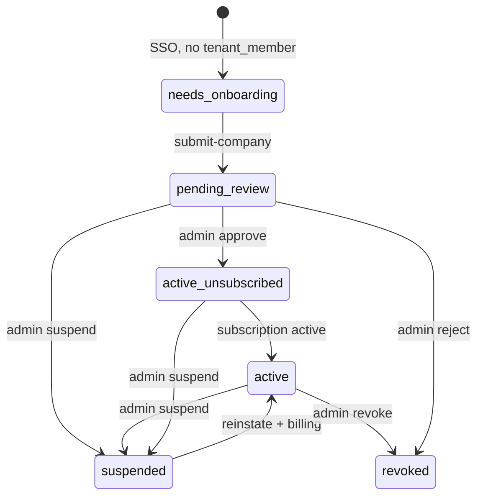

# FleetOS — Company Onboarding P0 (Technical Contract)

**Status:** Design only — no implementation in this document  
**Date:** 2026-05-29 (rev. 2026-05-28 — Demo Area + Billing Gate)  
**Based on:** Company onboarding audit (2026-05-29)  
**Scope:** Company owner path from Auth Core SSO → Demo Area (pending) → approval → limited app → full operations (subscription)

---

## 1. Purpose

Define the **P0** contract for FleetOS-managed company onboarding:

- Auth Core owns **identity** and **app-level FLEETOS membership** (`app_membership`).
- FleetOS owns **tenant**, **tenant_members**, **approval lifecycle**, and **billing gate** (read from tenant + Billing Core).
- No `tenant_applications` table in P0 — lifecycle is driven by `tenants.status` + `tenant_members.status` + subscription fields.
- **Pending owners are not dead-ended** on a static screen; they enter a **Demo Area** with read-only / marketing / support flows.
- **Approved tenants without subscription** enter a **limited app shell**; **operational writes** require active subscription.

---

## 2. Target user journey (P0)

```txt
Auth Core login/register
  → FleetOS /sso/callback (consume ticket)
  → fleetos-get-my-access
  → [no tenant] /onboarding/company
  → fleetos-submit-company
  → tenants.status = pending_review, tenant_members (owner, pending)
  → /demo  (Demo Area — NOT a blocking dead-end)
       · application status
       · product tour
       · complete company info (metadata)
       · support / help
       · pricing preview (no checkout until approved — see §4)
  → [admin] fleetos-admin-approve-tenant OR manual SQL
  → tenants.active + tenant_members.active (+ Auth app_membership active recommended)
  → fleetos-get-my-access → access_state active_unsubscribed (if no subscription)
  → /app  (limited shell: navigation, settings read-only, billing CTA)
       · NO operational creates (vehicles, bookings, drivers, invites, …)
  → [Billing Core] active subscription on tenant
  → fleetos-get-my-access → access_state active
  → /dashboard (full operational shell; writes allowed per role)
```

**Invited users (driver, admin, …):** Same billing gate at **tenant** level — if `tenant_billing !== active`, member may see limited/read-only shell but **cannot** perform operational writes (even when `tenant_members.status = active`).

---

## 3. Out of scope (P0)

| Area | Notes |
|------|--------|
| `tenant_invites` runtime | Schema exists; P1+ (invite accept still subject to billing gate when implemented) |
| Stripe / Billing Core **implementation** | Contract defines gate + URLs; checkout webhooks P1 |
| `tenant_customers` | Not part of onboarding |
| Booking / trip model | No real operational data in Demo Area |
| Advanced RBAC UI | Single owner role on create; role matrix documented for guards |
| `tenant_applications` table | Explicitly excluded |
| Multi-tenant selector UX | First tenant only |
| Email delivery for invites | N/A in P0 |
| Auth Core admin UI inside FleetOS | Approve via Edge or SQL runbook |

**In scope (contract only):** Demo Area routes, billing gate fields, `access_state` / `capabilities`, Edge response shape, future `ProtectedRoute` rules.

---

## 4. Four-layer access model

FleetOS routing and guards MUST evaluate **four independent dimensions**. Never collapse them into a single boolean.

### 4.1 Layer summary

| # | Layer | Source of truth | Session / API field | Question answered |
|---|--------|-----------------|---------------------|-------------------|
| 1 | **Auth membership** | Auth Core `app_membership` + JWT `membership_status` | `auth_membership_status`, `fleetosMembershipStatus` | May this identity use FleetOS at all? |
| 2 | **Tenant approval** | `tenants.status` + `tenant_members.status` | `gates.tenant_approval` | Is this company approved for this user? |
| 3 | **Tenant billing** | `tenants.billing_plan_code` + `tenants.subscription_status` (P0.1+) and/or Billing Core entitlement API (P1) | `gates.tenant_billing` | May this **company** run paid operations? |
| 4 | **Role permissions** | `tenant_members.role` (+ future `permissions` jsonb) | `membership.role`, `capabilities.*` | What may **this user** do inside an approved+billed tenant? |

### 4.2 Auth membership (layer 1)

| Value | Meaning | FleetOS UX |
|-------|---------|------------|
| `missing` | No FLEETOS app membership | Register / contact admin |
| `pending` | Identity ok; app access not fully granted | Demo Area or gates allowed if operational row exists |
| `active` | App membership granted | Normal FleetOS entry (still subject to layers 2–4) |
| `suspended` | Auth-level lock | `/access-suspended` |
| `revoked` | Auth-level permanent lock | `/access-revoked` |

**P0 rule:** Router uses **`fleetos-get-my-access`** as primary; Auth `pending` **does not** block Demo Area when `access_state === pending_review`.

### 4.3 Tenant approval (layer 2)

| `gates.tenant_approval` | DB condition (primary tenant row) | Demo / app access |
|-------------------------|-----------------------------------|-------------------|
| `none` | No non-removed `tenant_members` for `sub` | Onboarding only |
| `pending_review` | `tenants.status = pending_review` and/or member `pending`/`invited` | **Demo Area** (`/demo/*`) |
| `approved` | `tenants.status = active` AND `tenant_members.status = active` | Limited or full app (layer 3) |
| `suspended` | tenant or member `suspended` | `/access-suspended` |
| `revoked` | tenant `revoked`/`archived`/`inactive` or no viable membership | `/access-revoked` |

### 4.4 Tenant billing (layer 3)

| `gates.tenant_billing` | P0 read rule | Operational writes |
|------------------------|--------------|-------------------|
| `none` | `billing_plan_code` IS NULL AND (`subscription_status` IS NULL OR `none`) | **Denied** |
| `trialing` | `subscription_status = trialing` (optional P0.1 column) | **Allowed** (product decision) |
| `active` | `subscription_status = active` OR legacy `billing_plan_code` set + active | **Allowed** (if layer 2 approved + role permits) |
| `past_due` | `subscription_status = past_due` | **Denied** (read-only shell) |
| `canceled` | `subscription_status = canceled` | **Denied** |

**P0 minimum (no Billing Core API yet):** Treat subscription as active when `tenants.billing_plan_code IS NOT NULL` **or** `tenants.subscription_status = 'active'`. Document manual SQL seed for QA.

**P1:** Replace with Billing Core entitlement fetch; cache in Edge response `billing` object.

### 4.5 Role permissions (layer 4)

Canonical roles: `owner`, `admin`, `manager`, `dispatcher`, `driver`, `mechanic`, `viewer`.

| Capability | Typical roles (approved + billed) |
|------------|-----------------------------------|
| `can_manage_billing` | `owner`, `admin` |
| `can_invite_members` | `owner`, `admin` |
| `can_write_operational_data` | all except `viewer` (configurable) |
| `can_read_operational_data` | all active members |

**Billing gate overrides role:** If `gates.tenant_billing !== active` (and not `trialing`), **`can_write_operational_data = false`** for every role including `owner`.

### 4.6 Composite routing rule

```txt
IF NOT authenticated → /login
ELSE IF gates.tenant_approval = none → /onboarding/company
ELSE IF gates.tenant_approval = pending_review → /demo
ELSE IF gates.tenant_approval = approved AND gates.tenant_billing NOT IN (active, trialing) → /app (+ billing CTA)
ELSE IF gates.tenant_approval = approved AND gates.tenant_billing IN (active, trialing) → /dashboard
ELSE IF suspended → /access-suspended
ELSE IF revoked → /access-revoked
```

`access_state` (§8) is the **stable UX enum** derived from this matrix for redirects and analytics.

---

## 5. Schema changes (minimal P0)

### 5.1 `tenants.status` — extend CHECK

**Current (Phase 3):** `active`, `inactive`, `suspended`  
**P0 target:**

```sql
-- Proposed CHECK (replace tenants_status_check)
status IN (
  'pending_review',  -- submitted, awaiting FleetOS/CodeVertex admin
  'active',          -- operational
  'suspended',       -- temporary lock (align with docs)
  'revoked',         -- permanent disable
  'archived',        -- historical (optional P0, recommended for docs alignment)
  'inactive'         -- keep for backward compatibility OR map to archived
)
```

**Recommendation:** Treat legacy `inactive` as read-only compatibility; new writes use `archived` or `revoked` per lifecycle doc.

### 5.2 Columns on `tenants` (no new table)

Use existing columns + optional `metadata` jsonb if not present:

| Field | Use in onboarding |
|-------|-------------------|
| `name` | Legal / display company name (required) |
| `slug` | URL slug (required, unique) |
| `status` | `pending_review` on submit |
| `locale`, `currency`, `timezone` | Defaults from form or `pt-PT` / `EUR` / `Europe/Lisbon` |
| `logo_url`, `primary_color` | Optional on submit |
| `billing_plan_code` | NULL on submit; set on subscribe (manual P0 QA or Billing Core P1) |
| `subscription_status` | **P0.1 optional column** — `none`, `trialing`, `active`, `past_due`, `canceled` (see §5.6) |
| `legacy_company_id` | NULL |

**If `metadata` jsonb does not exist on `tenants`:** add in P0 migration:

```sql
ALTER TABLE public.tenants ADD COLUMN IF NOT EXISTS metadata jsonb NOT NULL DEFAULT '{}'::jsonb;
```

**Suggested `metadata` keys (P0):**

```json
{
  "onboarding": {
    "legal_name": "string",
    "tax_id": "string",
    "country_code": "PT",
    "submitted_at": "ISO8601",
    "submitted_by_codevertex_user_id": "uuid",
    "review_notes": null
  }
}
```

### 5.3 `tenant_members` (no schema change)

| Field | On submit | On approve |
|-------|-----------|------------|
| `role` | `owner` | `owner` |
| `status` | `pending` | `active` |
| `codevertex_user_id` | JWT `sub` | unchanged |
| `profile_id` | from `profiles` if exists | unchanged |
| `is_active` | `false` | `true` |

### 5.4 `tenant_settings`

Create row on submit with defaults (`booking_enabled`, etc. = true per Phase 3 migration).

### 5.5 RLS (P0 note)

Writes go through **Edge + service_role** only. No new permissive RLS for `authenticated` on insert tenants in P0.

### 5.6 Billing gate columns (P0.1 — contract; migration when implementing gate)

```sql
-- Optional P0.1 migration (not applied in initial onboarding schema)
ALTER TABLE public.tenants
  ADD COLUMN IF NOT EXISTS subscription_status text NOT NULL DEFAULT 'none';

ALTER TABLE public.tenants
  ADD CONSTRAINT tenants_subscription_status_check
  CHECK (subscription_status IN ('none', 'trialing', 'active', 'past_due', 'canceled'));

COMMENT ON COLUMN public.tenants.subscription_status IS
  'FleetOS billing gate. P0: manual/seed; P1: synced from Billing Core webhooks.';
```

**Demo Area:** No operational tables receive INSERT/UPDATE from the browser in P0; demo uses static/fixture content or metadata-only PATCH via future Edge.

---

## 6. Auth Core integration

### 6.1 Where data lives (Auth Core vs FleetOS)

| Concept | Auth Core | FleetOS DB |
|---------|-----------|------------|
| User identity | `auth.users` / profile | `profiles.codevertex_user_id` |
| App access FLEETOS | `app_memberships` (conceptual) | **not stored** — mirrored in session as `fleetosMembershipStatus` |
| Company / tenant | optional mirror fields | `tenants` |
| Role in company | optional on app membership | `tenant_members.role` |
| Tenant link on membership | optional claim / field | `tenant_members.tenant_id` |

### 6.2 Recommended Auth Core fields (contract with Auth team)

| Field | When set | Values (P0) |
|-------|----------|-------------|
| `app_code` | Always | `FLEETOS` |
| `fleetosMembershipStatus` / `fleetos_membership_status` | consume + updates | See lifecycle below |
| `fleetos_tenant_id` | After submit-company | UUID of `tenants.id` |
| `fleetos_role` | After submit-company | `owner` (canonical) or legacy `tenant_admin` until frontend canonical cut |

**JWT `codevertex_edge_jwt` claims (existing Edge verifier):**

| Claim | Onboarding submit | After approve |
|-------|-------------------|---------------|
| `sub` | user UUID | same |
| `membership_status` | `pending` recommended | `active` |
| `tenant_id` | new tenant UUID | same |
| `role` | `owner` | `owner` |
| `app_code` | `FLEETOS` | `FLEETOS` |
| `token_use` | `fleetos_edge_verify` | same |

### 6.3 When `app_membership` FLEETOS is `pending` vs `active`

| Event | Auth app membership | Rationale |
|-------|---------------------|-----------|
| User registers, no company | `missing` or `pending` | No operational access |
| After `fleetos-submit-company` | **`pending`** (recommended) | User authenticated but not operationally approved |
| After admin approve | **`active`** | Full FleetOS access |
| User suspended/revoked | `suspended` / `revoked` | Auth gate screens |

**FleetOS action after submit:** Call Auth Core admin API (out of band P0) **or** rely on next SSO consume returning `pending` if Auth sets it when `fleetos_tenant_id` is bound.

**P0 minimum if Auth API not ready:** FleetOS gates primarily on **operational** status; session `fleetosMembershipStatus` from consume may still be `active` — frontend must use `fleetos-get-my-access` as primary router (see §10).

### 6.4 `consume-sso-ticket` response (flat contract — already supported)

FleetOS parser accepts flat body; Edge onboarding must **not** assume `fleetos-sync-identity` runs on first login without an active tenant.

---

## 7. Edge Functions — overview

| Function | Auth | Purpose |
|----------|------|---------|
| `fleetos-get-my-access` | Bearer `codevertex_edge_jwt` | Resolve `access_state`, `gates`, `capabilities`, billing gate, redirect |
| `fleetos-submit-company` | Bearer `codevertex_edge_jwt` | Create tenant + owner member (pending) |
| `fleetos-admin-approve-tenant` | Service/admin secret (P0) | Approve tenant + member; optional Auth callback |

**Unchanged in P0 (behavioral note):**

- `fleetos-sync-identity` — call **after approval** or when JWT + tenant already `active`; not for initial pending create.
- `fleetos-list-tenants` — returns only **active** operational tenants for shell (P0: may return empty until `active` + subscription; limited shell uses get-my-access tenant blob).

**HTTP conventions (all P0 Edge):**

- `POST` only (except OPTIONS)
- CORS: `FLEETOS_ALLOWED_ORIGINS`
- Headers: `Authorization: Bearer <codevertex_edge_jwt>`, `apikey: <VITE_SUPABASE_ANON_KEY>`
- Errors: JSON `{ "error": "code", "message": "human-safe" }`

---

## 8. `fleetos-get-my-access`

### 8.1 Purpose

Single read after SSO (and on app boot) to determine:

- Does user need company onboarding?
- Should user enter **Demo Area** (`pending_review`)?
- Is tenant **approved** but **billing** blocks operational writes?
- Can user access **full** operational dashboard?
- What are the four **gates** and fine-grained **capabilities**?

### 8.2 Request

```http
POST /functions/v1/fleetos-get-my-access
Authorization: Bearer <codevertex_edge_jwt>
apikey: <supabase_anon_key>
Content-Type: application/json

{}
```

No body fields required (identity from JWT only).

### 8.3 Response `200` — envelope

```json
{
  "ok": true,
  "access_state": "needs_onboarding",
  "auth_membership_status": "pending",
  "codevertex_user_id": "uuid",
  "tenant": null,
  "membership": null,
  "gates": {
    "auth_membership": "pending",
    "tenant_approval": "none",
    "tenant_billing": "none",
    "role": null
  },
  "redirect_path": "/onboarding/company",
  "capabilities": {
    "can_submit_company": true,
    "can_access_demo_area": false,
    "can_access_app_shell": false,
    "can_access_dashboard": false,
    "can_access_operational_shell": false,
    "can_read_operational_data": false,
    "can_write_operational_data": false,
    "can_manage_billing": false,
    "can_invite_members": false,
    "can_view_application_status": false,
    "can_edit_company_application": false,
    "can_view_pricing": false,
    "can_start_checkout": false,
    "can_contact_support": true
  }
}
```

**Backward compatibility (P0.3 implement):** Clients may ignore unknown `gates` / capability keys. Existing `access_state` values `needs_onboarding`, `pending_review`, `suspended`, `revoked` are unchanged; **`active` splits** (see below).

### 8.4 `access_state` enum (P0 — revised)

| Value | Layers (summary) | `redirect_path` | User-facing mode |
|-------|------------------|-----------------|------------------|
| `needs_onboarding` | approval `none` | `/onboarding/company` | Submit company form |
| `pending_review` | approval `pending_review` | `/demo` | **Demo Area** (not a blocking page) |
| `active_unsubscribed` | approval `approved`, billing not `active`/`trialing` | `/app` | Limited app shell + billing CTA |
| `active` | approval `approved`, billing `active` or `trialing` | `/dashboard` | Full operational shell |
| `suspended` | approval `suspended` | `/access-suspended` | Blocked |
| `revoked` | approval `revoked` | `/access-revoked` | Blocked |

**Deprecated redirect:** `/pending-approval` as primary landing — keep route as **alias** → `/demo` or `/demo/status` (301/replace in router).

**Priority when multiple rows exist (P0):** Prefer highest tenant: `active` (with billing split) > `pending_review` > `suspended` > `revoked`. Multi-tenant picker is out of scope — return **primary** tenant (most recent `created_at`).

### 8.4.1 `gates` object (required in response)

| Field | Type | Values |
|-------|------|--------|
| `auth_membership` | string | `missing`, `pending`, `active`, `suspended`, `revoked` (from JWT, normalized) |
| `tenant_approval` | string | `none`, `pending_review`, `approved`, `suspended`, `revoked` |
| `tenant_billing` | string | `none`, `trialing`, `active`, `past_due`, `canceled` |
| `role` | string \| null | Canonical role from `tenant_members.role` |

### 8.4.2 `capabilities` matrix (by `access_state`)

| Capability | `needs_onboarding` | `pending_review` | `active_unsubscribed` | `active` |
|------------|-------------------|------------------|----------------------|----------|
| `can_submit_company` | true | false | false | false |
| `can_access_demo_area` | false | **true** | false | false |
| `can_access_app_shell` | false | false | **true** | true |
| `can_access_dashboard` | false | false | false | **true** |
| `can_access_operational_shell` | false | false | true (read) | **true** |
| `can_read_operational_data` | false | false | true (fixtures/empty) | true |
| `can_write_operational_data` | false | false | **false** | **true** |
| `can_manage_billing` | false | false | owner/admin | owner/admin |
| `can_invite_members` | false | false | **false** | owner/admin |
| `can_view_application_status` | false | **true** | false | false |
| `can_edit_company_application` | false | **true** (metadata only) | false | false |
| `can_view_pricing` | false | **true** (preview) | **true** | true |
| `can_start_checkout` | false | **false** | **true** | true (upgrade) |
| `can_contact_support` | true | **true** | true | true |

**Demo Area:** `can_write_operational_data` is always **false**. No API calls that INSERT into `vehicles`, `booking_requests`, `drivers`, etc.

**Invited member with `active_unsubscribed`:** Same as owner for billing gate — `can_write_operational_data = false` until tenant billing active.

### 8.5 Response examples by state

#### `needs_onboarding`

```json
{
  "ok": true,
  "access_state": "needs_onboarding",
  "auth_membership_status": "active",
  "codevertex_user_id": "a0000000-0000-4000-8000-0000000000c1",
  "tenant": null,
  "membership": null,
  "redirect_path": "/onboarding/company",
  "capabilities": {
    "can_submit_company": true,
    "can_access_dashboard": false,
    "can_access_operational_shell": false
  }
}
```

#### `pending_review` (Demo Area)

```json
{
  "ok": true,
  "access_state": "pending_review",
  "auth_membership_status": "pending",
  "codevertex_user_id": "a0000000-0000-4000-8000-0000000000c1",
  "tenant": {
    "id": "t-uuid",
    "name": "Acme Transport Lda",
    "slug": "acme-transport",
    "status": "pending_review",
    "submitted_at": "2026-05-29T12:00:00.000Z"
  },
  "membership": {
    "id": "m-uuid",
    "role": "owner",
    "status": "pending"
  },
  "gates": {
    "auth_membership": "pending",
    "tenant_approval": "pending_review",
    "tenant_billing": "none",
    "role": "owner"
  },
  "redirect_path": "/demo",
  "capabilities": {
    "can_submit_company": false,
    "can_access_demo_area": true,
    "can_access_app_shell": false,
    "can_access_dashboard": false,
    "can_access_operational_shell": false,
    "can_read_operational_data": false,
    "can_write_operational_data": false,
    "can_manage_billing": false,
    "can_invite_members": false,
    "can_view_application_status": true,
    "can_edit_company_application": true,
    "can_view_pricing": true,
    "can_start_checkout": false,
    "can_contact_support": true
  }
}
```

#### `active_unsubscribed` (approved, billing gate)

```json
{
  "ok": true,
  "access_state": "active_unsubscribed",
  "auth_membership_status": "active",
  "codevertex_user_id": "a0000000-0000-4000-8000-0000000000c1",
  "tenant": {
    "id": "t-uuid",
    "name": "Acme Transport Lda",
    "slug": "acme-transport",
    "status": "active",
    "submitted_at": "2026-05-28T10:00:00.000Z",
    "billing_plan_code": null,
    "subscription_status": "none"
  },
  "membership": {
    "id": "m-uuid",
    "role": "owner",
    "status": "active"
  },
  "gates": {
    "auth_membership": "active",
    "tenant_approval": "approved",
    "tenant_billing": "none",
    "role": "owner"
  },
  "redirect_path": "/app",
  "capabilities": {
    "can_submit_company": false,
    "can_access_demo_area": false,
    "can_access_app_shell": true,
    "can_access_dashboard": false,
    "can_access_operational_shell": true,
    "can_read_operational_data": true,
    "can_write_operational_data": false,
    "can_manage_billing": true,
    "can_invite_members": false,
    "can_view_application_status": false,
    "can_edit_company_application": false,
    "can_view_pricing": true,
    "can_start_checkout": true,
    "can_contact_support": true
  },
  "billing": {
    "checkout_url": "https://billing.codevertex.cc/...",
    "manage_url": null
  }
}
```

#### `active` (approved + subscription)

```json
{
  "ok": true,
  "access_state": "active",
  "auth_membership_status": "active",
  "codevertex_user_id": "a0000000-0000-4000-8000-0000000000c1",
  "tenant": {
    "id": "t-uuid",
    "name": "Acme Transport Lda",
    "slug": "acme-transport",
    "status": "active",
    "submitted_at": "2026-05-28T10:00:00.000Z",
    "billing_plan_code": "fleetos_pro",
    "subscription_status": "active"
  },
  "membership": {
    "id": "m-uuid",
    "role": "owner",
    "status": "active"
  },
  "gates": {
    "auth_membership": "active",
    "tenant_approval": "approved",
    "tenant_billing": "active",
    "role": "owner"
  },
  "redirect_path": "/dashboard",
  "capabilities": {
    "can_submit_company": false,
    "can_access_demo_area": false,
    "can_access_app_shell": true,
    "can_access_dashboard": true,
    "can_access_operational_shell": true,
    "can_read_operational_data": true,
    "can_write_operational_data": true,
    "can_manage_billing": true,
    "can_invite_members": true,
    "can_view_application_status": false,
    "can_edit_company_application": false,
    "can_view_pricing": true,
    "can_start_checkout": true,
    "can_contact_support": true
  }
}
```

#### `suspended` / `revoked`

Same shape with `access_state` and matching `redirect_path`; include `tenant.status` / `membership.status` for UI copy.

### 8.6 Error responses

| HTTP | `error` | When |
|------|---------|------|
| 401 | `invalid_token` | JWT invalid/expired |
| 403 | `cors_origin_not_allowed` | Origin |
| 500 | `server_misconfigured` | Missing Supabase env |

---

## 9. `fleetos-submit-company`

### 9.1 Purpose

Create company workspace in **pending** state and link submitting user as **owner** (pending).

### 9.2 Request body

```json
{
  "company": {
    "name": "Acme Transport Lda",
    "legal_name": "Acme Transport Unipessoal Lda",
    "slug": "acme-transport",
    "country_code": "PT",
    "tax_id": "123456789",
    "locale": "pt-PT",
    "currency": "EUR",
    "timezone": "Europe/Lisbon",
    "primary_color": "#00B39A",
    "logo_url": null
  }
}
```

### 9.3 Field validation (P0)

| Field | Required | Rules |
|-------|----------|-------|
| `company.name` | Yes | 2–120 chars, trim |
| `company.legal_name` | Yes | 2–200 chars |
| `company.slug` | Yes | `^[a-z0-9]+(?:-[a-z0-9]+)*$`, 3–48 chars, unique in `tenants.slug` |
| `company.country_code` | Yes | ISO 3166-1 alpha-2 (e.g. `PT`) |
| `company.tax_id` | Yes for `PT` | Non-empty; format validation P1 (NIF checksum optional P0: length 9 for PT) |
| `company.locale` | No | Default `pt-PT` |
| `company.currency` | No | Default `EUR` |
| `company.timezone` | No | Default `Europe/Lisbon` |
| `company.primary_color` | No | Hex `#RRGGBB` |
| `company.logo_url` | No | HTTPS URL or null |

### 9.4 Idempotency and constraints

| Rule | Implementation |
|------|----------------|
| **One pending tenant per owner** | Before insert: `SELECT` `tenant_members` WHERE `codevertex_user_id = sub` AND `status IN ('pending','invited')` JOIN tenant `pending_review` → if exists return **409** `pending_application_exists` with existing tenant id |
| **One active owner tenant** | If user already has `active` membership → **409** `already_has_active_membership` |
| **Slug unique** | DB unique constraint → map to **409** `slug_taken` |
| **Retry same payload** | Optional: same `sub` + same `slug` + `pending_review` within 24h → return **200** existing application (idempotent success) |

### 9.5 Success response `201` (or `200` idempotent)

```json
{
  "ok": true,
  "access_state": "pending_review",
  "tenant": {
    "id": "t-uuid",
    "name": "Acme Transport Lda",
    "slug": "acme-transport",
    "status": "pending_review",
    "submitted_at": "2026-05-29T12:00:00.000Z"
  },
  "membership": {
    "id": "m-uuid",
    "role": "owner",
    "status": "pending"
  },
  "redirect_path": "/demo",
  "auth_core": {
    "recommended_membership_status": "pending",
    "fleetos_tenant_id": "t-uuid",
    "fleetos_role": "owner"
  }
}
```

**Post-submit FleetOS frontend:**

1. Store nothing extra in localStorage beyond session.
2. Navigate to `/demo` (Demo Area home / application status).
3. (Optional) Call Auth Core internal API to set app membership `pending` + `fleetos_tenant_id` — **dependency** documented in runbook.

### 9.6 Error responses

| HTTP | `error` | When |
|------|---------|------|
| 400 | `validation_error` | Invalid body; include `fields: { "company.slug": "..." }` |
| 401 | `invalid_token` | JWT |
| 409 | `slug_taken` | Unique violation |
| 409 | `pending_application_exists` | User already has pending company |
| 409 | `already_has_active_membership` | User already operational |
| 500 | `database_error` | Insert failed |

### 9.7 Database writes (transaction)

```txt
BEGIN;
  INSERT tenants (status=pending_review, name, slug, metadata.onboarding, ...);
  INSERT tenant_settings (tenant_id, defaults);
  UPSERT profiles (codevertex_user_id=sub) if missing;
  INSERT tenant_members (tenant_id, sub, profile_id, role=owner, status=pending, is_active=false);
COMMIT;
```

**Do not** call `fleetos-sync-identity` in same request (it requires active tenant).

---

## 10. `fleetos-admin-approve-tenant` (P0)

### 10.1 Purpose

Transition `pending_review` → `active` for tenant and submitting owner member.

### 10.2 Auth options (choose one for P0)

| Option | Pros | Cons |
|--------|------|------|
| **A. Edge + shared secret** | Auditable, repeatable | Need `FLEETOS_ADMIN_SECRET` header |
| **B. Manual SQL runbook** | Fastest for first prod test | No audit in Edge logs |

**P0 recommendation:** Implement **B first** for manual QA, **A** before external pilots.

### 10.3 Request (Option A)

```http
POST /functions/v1/fleetos-admin-approve-tenant
X-FleetOS-Admin-Secret: <secret>
Content-Type: application/json

{
  "tenant_id": "t-uuid",
  "reviewer_note": "Approved — docs verified",
  "activate_auth_membership": true
}
```

### 10.4 Success response

```json
{
  "ok": true,
  "tenant": {
    "id": "t-uuid",
    "status": "active"
  },
  "membership": {
    "id": "m-uuid",
    "status": "active",
    "role": "owner"
  },
  "auth_core": {
    "recommended_membership_status": "active",
    "fleetos_tenant_id": "t-uuid",
    "fleetos_role": "owner"
  }
}
```

### 10.5 SQL runbook (Option B — P0 manual)

```sql
-- Verify
SELECT t.id, t.status, tm.id, tm.status, tm.codevertex_user_id
FROM tenants t
JOIN tenant_members tm ON tm.tenant_id = t.id
WHERE t.id = '<tenant_id>' AND tm.role = 'owner';

BEGIN;
UPDATE tenants SET status = 'active', updated_at = now() WHERE id = '<tenant_id>' AND status = 'pending_review';
UPDATE tenant_members SET status = 'active', is_active = true, updated_at = now()
WHERE tenant_id = '<tenant_id>' AND status = 'pending';
COMMIT;
```

Then update Auth Core app membership to `active` + `fleetos_tenant_id` (manual/API).

### 10.6 Preconditions

- Tenant `status = pending_review`
- At least one `tenant_members` with `status = pending` and `role IN ('owner','admin')`
- `profiles` row exists for owner (create if missing)

### 10.7 Post-approve

User refreshes or re-login → `fleetos-get-my-access`:

- If billing not active → `active_unsubscribed` → `/app`
- If billing active → `active` → `/dashboard`

Optional: user triggers `fleetos-sync-identity` once when `access_state` is `active` or `active_unsubscribed` (JWT `tenant_id` set) — sync is **not** required for Demo Area.

**P0 QA seed billing (manual):**

```sql
UPDATE tenants
SET billing_plan_code = 'fleetos_pro', subscription_status = 'active', updated_at = now()
WHERE id = '<tenant_id>';
```

---

## 11. Post-SSO redirect matrix (frontend)

### 11.1 Decision flow

```txt
/sso/callback
  → consumeSsoTicket (flat contract)
  → completeSsoLogin (session; NO fleetos-sync-identity unless access_state will be active)
  → POST fleetos-get-my-access
  → navigate(redirect_path from response OR local matrix)
```

### 11.2 Matrix

| `access_state` | Auth (typical) | `gates.tenant_approval` | `gates.tenant_billing` | Navigate to | sync-identity? |
|----------------|----------------|-------------------------|------------------------|-------------|----------------|
| `needs_onboarding` | any | `none` | `none` | `/onboarding/company` | No |
| `pending_review` | `pending` ok | `pending_review` | `none` | `/demo` | No |
| `active_unsubscribed` | `active` | `approved` | `none`/`past_due`/`canceled` | `/app` | Optional |
| `active` | `active` | `approved` | `active`/`trialing` | `/dashboard` | Yes (optional) |
| `suspended` | any | `suspended` | any | `/access-suspended` | No |
| `revoked` | any | `revoked` | any | `/access-revoked` | No |

### 11.3 Fallback if `get-my-access` fails

| Condition | Navigate |
|-----------|----------|
| consume OK, get-my-access 401 | `/login` (clear session) |
| consume OK, get-my-access 5xx | `/demo` with error banner + retry (if tenant pending) else `/app` |
| consume OK, legacy session only | Use session + empty tenants → `/onboarding/company` if `missing`, else gate |

### 11.4 `return_to` query param

**P0 rule:** Honor `return_to` only when `access_state === 'active'` **and** `capabilities.can_write_operational_data === true`. Otherwise use `redirect_path` from Edge.

### 11.5 Route guards (future implementation — §14)

| Route prefix | Allowed `access_state` | Notes |
|--------------|------------------------|-------|
| `/onboarding/company` | `needs_onboarding` | Block if pending application exists (409 on resubmit) |
| `/demo`, `/demo/*` | `pending_review` | Demo Area layout; no operational APIs |
| `/pending-approval` | `pending_review` | **Legacy alias** → redirect `/demo` or `/demo/status` |
| `/app`, `/app/*` | `active_unsubscribed`, `active` | Limited shell; writes gated by capabilities |
| `/billing/*` | `active_unsubscribed`, `active` | Billing Core deep links; `can_start_checkout` |
| `/dashboard`, `/admin/*`, … | `active` only | `can_access_dashboard` + `can_write_operational_data` for mutations |
| `/login?signed_out=1` | public | No auto SSO (existing) |

**Disable** `AuthenticatedGateRoute` redirect to `/dashboard` when `access_state` is not `active`.

### 11.6 Demo Area pages (P0.3 UI contract)

| Path | Purpose | Data |
|------|---------|------|
| `/demo` | Home — welcome + application summary | `tenant`, `membership`, `gates` from get-my-access |
| `/demo/status` | Application timeline (submitted → in review → approved) | `tenant.status`, `metadata.onboarding` |
| `/demo/tour` | Product tour / screenshots / video embed | Static content |
| `/demo/company` | Complete or edit application fields | PATCH metadata via future Edge (no operational tables) |
| `/demo/pricing` | Plans comparison (read-only preview) | Static + link to Billing when approved |
| `/demo/support` | Contact support / help center | `openHelpCenter`, email link |

**Layout:** Shared `DemoLayout` (sidebar or tabs), FleetOS branding, sign-out, link to Auth Core profile.

### 11.7 Limited app + billing pages (post-approval)

| Path | Purpose | When |
|------|---------|------|
| `/app` | Post-approval home — “Subscribe to unlock fleet operations” | `active_unsubscribed` |
| `/app/billing` | Plans + `can_start_checkout` → Billing Core | `active_unsubscribed`, `active` |
| `/app/settings` | Company settings read-only or billing-only edits | Until subscribed |

**Driver / invited user:** Lands on `/app` with banner “Your company subscription is inactive” — `can_write_operational_data: false`.

---

## 12. Company form payload (UI → API)

### 12.1 Form fields (P0)

| UI label | API field | Required |
|----------|-----------|----------|
| Company name | `company.name` | Yes |
| Legal name | `company.legal_name` | Yes |
| URL slug | `company.slug` | Yes (auto from name, editable) |
| Country | `company.country_code` | Yes |
| Tax ID / NIF | `company.tax_id` | Yes |
| — | `company.locale` | Hidden default |
| — | `company.currency` | Hidden default |
| — | `company.timezone` | Hidden default |

### 12.2 Slug generation

- Client suggests from `name`: lowercase, strip accents, hyphenate.
- Server validates uniqueness; return `slug_taken` with suggestion optional P1.

---

## 13. `fleetos-sync-identity` — P0 behavioral contract

| Scenario | Call? |
|----------|-------|
| First SSO, `needs_onboarding` | **No** |
| After submit, `pending_review` (Demo Area) | **No** |
| After approve, `active_unsubscribed` | **Optional** (profile parity; no operational writes) |
| After subscribe, `active` | **Yes** (idempotent upsert) |
| Returning `active` user | **Yes** |

Sync failure must **not** block UI if `get-my-access` already allows the current shell (warn only).

---

## 14. Session / TenantProvider / ProtectedRoute (future — implement later)

### 14.1 Session store (extend)

Persist last `get-my-access` payload (or subset):

| Field | Use |
|-------|-----|
| `accessState` | Router + guards |
| `gates` | Debug UI + fine gates |
| `capabilities` | Button visibility + API client write guard |
| `redirectPath` | SSO callback navigation |

### 14.2 TenantProvider

| Flag | Derivation |
|------|------------|
| `canAccessDemoArea` | `capabilities.can_access_demo_area` |
| `canAccessAppShell` | `capabilities.can_access_app_shell` |
| `canAccessOperationalShell` | `capabilities.can_access_operational_shell` |
| `canWriteOperationalData` | `capabilities.can_write_operational_data` |
| `canAccessDashboard` | `capabilities.can_access_dashboard` |

**Remove** single boolean that equates “has tenants” with full access. DEV `MOCK_TENANTS` only when SSO consume URL unset.

### 14.3 ProtectedRoute (replace current behavior)

```txt
ProtectedRoute (full ops routes):
  require isAuthenticated
  require accessState === 'active'
  require capabilities.can_write_operational_data (for mutation routes)
  else redirect → redirectPath or /app or /demo

DemoRoute:
  require isAuthenticated
  require accessState === 'pending_review'

AppShellRoute:
  require isAuthenticated
  require accessState in ('active_unsubscribed', 'active')
```

**Current anti-pattern (fix in P0.3):** `canAccessOperationalShell` false → hard redirect `/pending-approval` blocks Demo Area.

### 14.4 API client guard (frontend)

Before POST/PATCH/DELETE to operational Supabase tables or Edge mutators:

```txt
if (!capabilities.can_write_operational_data) → show billing/approval toast; abort
```

### 14.5 Edge `fleetos-get-my-access` resolution (implement later)

```txt
1. Load tenant_members + tenants (existing)
2. Compute gates.tenant_approval from row (existing resolveRowAccessState → map)
3. Read tenants.billing_plan_code, tenants.subscription_status
4. Compute gates.tenant_billing
5. If approval approved AND billing not active/trialing → access_state = active_unsubscribed
6. If approval approved AND billing active/trialing → access_state = active
7. If pending_review → access_state = pending_review, redirect /demo
8. Build capabilities from §8.4.2
```

### 14.6 Primary redirect source

`fleetos-get-my-access.redirect_path` — always prefer over Auth-only heuristics.

---

## 15. Implementation plan (phased)

### Phase P0.1 — Schema (1 migration)

- Extend `tenants.status` CHECK.
- Add `tenants.metadata` jsonb if missing.
- Document rollback.

### Phase P0.2 — Edge

- Implement `fleetos-get-my-access` (baseline — **extend** for `active_unsubscribed`, `gates`, capabilities §8).
- Implement `fleetos-submit-company` (`redirect_path: /demo`).
- Deploy secrets: `CODEVERTEX_JWKS_URI`, CORS defaults, optional `FLEETOS_ADMIN_SECRET`.
- Manual approve SQL runbook.

### Phase P0.2b — Edge billing gate (contract revision)

- Extend `fleetos-get-my-access` per §14.5.
- Migration `subscription_status` (§5.6) when implementing gate.
- Optional `billing` object in response (checkout URL from env).

### Phase P0.3 — Frontend

- Routes: `/onboarding/company`, `/demo/*`, `/app`, `/app/billing`; alias `/pending-approval` → `/demo`.
- `DemoLayout` + pages per §11.6.
- Update `SsoCallback` (get-my-access, redirect matrix §11.2).
- Fix `ProtectedRoute` / `DemoRoute` / `AppShellRoute` per §14.3.
- Disable DEV `MOCK_TENANTS` when `VITE_AUTH_SSO_CONSUME_URL` set.
- API write guard per §14.4.

### Phase P0.4 — Auth Core coordination

- Document: on submit, Auth sets `pending` + `fleetos_tenant_id` + `fleetos_role`.
- Document: on approve, Auth sets `active`.
- Verify consume returns updated `fleetosMembershipStatus` + JWT claims.

### Phase P0.5 — QA

| Test | Expected |
|------|----------|
| New user SSO | `/onboarding/company` |
| Submit company | `pending_review`, `/demo`, `can_access_demo_area` |
| Demo navigation | All `/demo/*` without operational API writes |
| Double submit | 409 `pending_application_exists` |
| Duplicate slug | 409 `slug_taken` |
| SQL approve (no billing) | `active_unsubscribed`, `/app`, writes blocked |
| SQL seed billing | `active`, `/dashboard`, writes allowed |
| Driver on unsubscribed tenant | `/app`, `can_write_operational_data: false` |
| Network | consume → get-my-access → no sync in demo → sync after `active` |

### Phase P1 (after P0)

- `fleetos-admin-approve-tenant` Edge.
- Billing Core webhooks → `subscription_status`.
- Auth Core webhook / admin API automation.
- `tenant_invites` create/accept (billing-gated).
- NIF validation, email notifications.

---

## 16. State transition diagram



---

## 17. Open decisions (resolve before implement)

| # | Question | Recommendation |
|---|----------|----------------|
| 1 | Auth membership `active` before company approved? | **No** — use `pending` after submit; Demo Area still allowed |
| 2 | Checkout in Demo Area before approval? | **No** — `can_start_checkout: false` until `approved` |
| 3 | `trialing` grants writes? | **Yes** (product default); document in Billing Core |
| 4 | Keep `inactive` tenant status? | Yes read-only; new writes use `archived` |
| 5 | `fleetos-sync-identity` when? | Optional at `active_unsubscribed`; recommended at `active` |
| 6 | Admin approve in UI? | P0 SQL only; Edge admin P1 |
| 7 | Store tax_id only in metadata? | Yes P0; legal_name in metadata.onboarding |
| 8 | Split `active` vs `active_unsubscribed`? | **Yes** — explicit `access_state` (this revision) |
| 9 | `/pending-approval` route? | Keep as redirect alias to `/demo` |

---

## 18. References

- `docs/architecture/FLEETOS_MEMBERSHIP_LIFECYCLE.md`
- `docs/architecture/FLEETOS_AUTH_IMPLEMENTATION_PLAN.md`
- `docs/architecture/FLEETOS_IDENTITY_AND_TENANCY_MODEL.md`
- `docs/integration/FLEETOS_PHASE6_EDGE_IDENTITY_REPORT.md`
- `supabase/migrations/20260524140000_phase3_tenant_layer.sql`
- `supabase/migrations/20260528150000_phase2a_tenant_members_foundation.sql`

---

## 19. Changelog

| Date | Change |
|------|--------|
| 2026-05-29 | Initial P0 contract (design only) |
| 2026-05-28 | **Demo Area + Billing Gate:** four-layer model; `access_state` adds `active_unsubscribed`; `pending_review` → `/demo`; `gates` + expanded `capabilities`; route/guard matrix §11–14; optional `subscription_status` column §5.6 |
