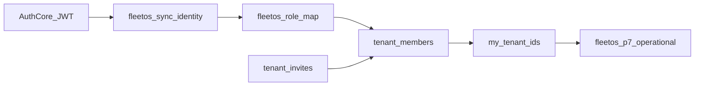

# FleetOS — Phase 2B Canonical Membership Cut Plan

**Status:** Accepted — ready for implementation  
**Date:** 2026-05-28  
**Supersedes:** Phase 2A.5 trigger mirror strategy (`tenant_users` → `tenant_members` dual-write)  
**Scope:** Architecture and execution plan only — **no migrations, code, or Edge changes in this document**

---

## Related documents

| Document | Role |
|----------|------|
| [DECISION_001_TENANT_MEMBERS_NAMING.md](../decision/DECISION_001_TENANT_MEMBERS_NAMING.md) | Canonical naming; original 2A/2B/2C phasing |
| [FLEETOS_PHASE2A_MEMBERSHIP_PLAN.md](./FLEETOS_PHASE2A_MEMBERSHIP_PLAN.md) | Phase 2A additive foundation (2A.5 **cancelled** by this plan) |
| [FLEETOS_IDENTITY_AND_TENANCY_MODEL.md](./FLEETOS_IDENTITY_AND_TENANCY_MODEL.md) | Target tenancy model |
| [FLEETOS_RBAC_MODEL.md](./FLEETOS_RBAC_MODEL.md) | Canonical roles and permissions |
| [FLEETOS_MEMBERSHIP_LIFECYCLE.md](./FLEETOS_MEMBERSHIP_LIFECYCLE.md) | Member and invite state machines |
| [FLEETOS_AUTH_IMPLEMENTATION_PLAN.md](./FLEETOS_AUTH_IMPLEMENTATION_PLAN.md) | Auth and onboarding flows |
| [FLEETOS_PHASE3_APPLIED_REPORT.md](../database/FLEETOS_PHASE3_APPLIED_REPORT.md) | Dev DB row counts after Phase 3 |
| [FLEETOS_PHASE6_EDGE_IDENTITY_REPORT.md](../integration/FLEETOS_PHASE6_EDGE_IDENTITY_REPORT.md) | Edge sync contract |
| [FLEETOS_PHASE7_APPLIED_REPORT.md](../database/FLEETOS_PHASE7_APPLIED_REPORT.md) | Tenant-aware RLS foundation |

---

## Executive decision

```txt
tenant_members     = sole operational membership table
tenant_users       = DROP when COUNT(*) = 0 on target environment (dev first)
fleetos_role_map   = legacy → canonical bridge at Edge write time (JWT unchanged)
Phase 2A.5         = CANCELLED (no trigger mirror)
DECISION_001 2C    = absorbed into this cut (no separate long-lived tenant_users)
```

FleetOS is **not in production**, has **no real membership data** in `tenant_users`, and has **less than ~30% of product features** implemented. The long compatibility path (mirror trigger + later rename + later drop) costs more than a **single canonical cut** now.

---

## 1. Context

### 1.1 Product and environment

- FleetOS is a React/Vite/TypeScript app with CodeVertex Auth Core SSO, membership gating, and Supabase operational DB (dev project `kjiwzqysjassakvrojun`).
- **Operational UI data remains mock** — admin/ops screens do not read `tenant_users` or `tenant_members` via PostgREST today.
- Phase 1 (platform links), Phase 6 (Edge JWT verification + identity sync), and Phase 7 (tenant-aware RLS **foundation**) are in place.
- Phase 2A.2–2A.4 migrations are **committed** in the repository; Phase 2A.5 (trigger mirror) was **never implemented**.

### 1.2 What Phase 2A delivered (keep)

| Migration | Object |
|-----------|--------|
| `20260528150000_phase2a_tenant_members_foundation.sql` | `tenant_members` (canonical schema, deny-by-default RLS) |
| `20260528160000_phase2a_role_map_foundation.sql` | `fleetos_role_map` (8 legacy → canonical rows) |
| `20260528170000_phase2a_tenant_invites_foundation.sql` | `tenant_invites` (schema only; FK → `tenant_members`) |

### 1.3 What still points at legacy `tenant_users`

| Layer | Current dependency |
|-------|-------------------|
| SQL helpers | `my_tenant_ids()`, `is_tenant_user()`, `is_tenant_admin()` query `tenant_users` |
| RLS Phase 7 | `fleetos_p7_authenticated_select_own_tenant_users` on `tenant_users`; operational policies use `my_tenant_ids()` |
| Edge | `fleetos-sync-identity`, `fleetos-list-tenants` upsert/select `tenant_users` |
| Frontend types | `FleetosRole` uses legacy role strings (`tenant_admin`, `fleet_manager`, …) |

---

## 2. Evidence: empty data and low risk

### 2.1 Reported dev database state

Source: [FLEETOS_PHASE3_APPLIED_REPORT.md](../database/FLEETOS_PHASE3_APPLIED_REPORT.md) (2026-05-26, project `kjiwzqysjassakvrojun`).

| Object | Count |
|--------|------:|
| `tenants` | 1 |
| `tenant_settings` | 1 |
| `tenant_domains` | 0 |
| **`tenant_users`** | **0** |
| `companies` with `tenant_id` | 1 (demo company ↔ tenant) |

After Phase 2A.2–2A.4 apply (expected): `tenant_members` = 0, `tenant_invites` = 0, `fleetos_role_map` = 8 reference rows.

### 2.2 Codebase evidence

- Frontend **does not** query `tenant_users` / `tenant_members` — tenants come from Edge + mock fallback in `TenantProvider`.
- `RoleGuard` exists but is a **stub** — not wired across admin routes.
- Membership **gate** uses Auth Core `fleetosMembershipStatus` (session), not DB membership rows.
- `company_users` → `tenant_members` backfill was **never run**.

### 2.3 Mandatory gate before DROP (B.0)

Run on **each** target environment before B.1:

```sql
SELECT 'tenant_users' AS rel, COUNT(*) AS n FROM public.tenant_users
UNION ALL
SELECT 'tenant_members', COUNT(*) FROM public.tenant_members;
```

| Condition | Action |
|-----------|--------|
| `tenant_users` = 0 | Proceed with DROP in B.1 |
| `tenant_users` > 0 | **Abort DROP** — migrate rows to `tenant_members` using `fleetos_role_map`, then DROP |

---

## 3. Why abandon Phase 2A.5 trigger mirror

| Reason | Detail |
|--------|--------|
| No data to preserve | 0 rows in `tenant_users` on dev |
| No production consumers | Mirror would sync into an empty canonical table with no readers |
| Drift risk | Two tables + trigger require ongoing consistency checks |
| Architecture already aligned | `tenant_invites` FK targets `tenant_members`, not `tenant_users` |
| DECISION_001 Phase 2A intent | Compatibility layer for **production with live membership data** — not applicable |
| Effort | 2A.5 + 2B rename + 2C drop ≈ **more work** than one coordinated B.1–B.4 cut |

**Phase 2A.5 status:** **CANCELLED** — do not implement `AFTER INSERT/UPDATE ON tenant_users` mirror trigger.

---

## 4. Target architecture

### 4.1 Single membership table

`public.tenant_members` becomes the **only** operational membership store:

- Canonical `role` (`owner`, `admin`, `manager`, `dispatcher`, `driver`, `mechanic`, `viewer`)
- Lifecycle `status` (`invited`, `pending`, `active`, `suspended`, `removed`)
- Optional `legacy_role` for audit when Auth Core / JWT still emits legacy strings
- `is_active` retained for transition; prefer `status = 'active'` in new logic

### 4.2 Remove `tenant_users`

When B.0 gate passes:

1. Drop Phase 7 policy `fleetos_p7_authenticated_select_own_tenant_users`
2. `DROP TABLE public.tenant_users`

Historical migrations in git remain for audit; the live database no longer exposes the table.

### 4.3 `fleetos_role_map` at Edge only

- **JWT contract unchanged** — Auth Core may continue sending legacy role strings.
- Edge `fleetos-sync-identity` resolves canonical role:

```txt
JWT role (legacy or canonical)
  → lookup fleetos_role_map.legacy_role (if legacy)
  → else use role if already canonical
  → else default viewer
  → upsert tenant_members.role = canonical
  → tenant_members.legacy_role = original JWT role when mapped
```

- No dual-table write path.

### 4.4 Diagram (target state)



---

## 5. Role mapping reference

From [20260528160000_phase2a_role_map_foundation.sql](../../supabase/migrations/20260528160000_phase2a_role_map_foundation.sql):

| Legacy (`tenant_users` era) | Canonical (`tenant_members`) | Notes |
|-----------------------------|------------------------------|--------|
| `tenant_admin` | `admin` | |
| `fleet_manager` | `manager` | |
| `operations` | `manager` | Collapsed pending RBAC split |
| `dispatcher` | `dispatcher` | 1:1 |
| `finance` | `manager` | **TRANSITIONAL** |
| `driver` | `driver` | 1:1 |
| `owner` | `owner` | Tenant owner, not vehicle owner |
| `viewer` | `viewer` | 1:1 |
| *(none)* | `mechanic` | Assign via invites/admin only |

**`customer`** remains out of scope — belongs on `tenant_customers` (future).

### 5.1 `is_tenant_admin()` after B.2

| Before (Phase 3/7) | After (Phase 2B) |
|--------------------|------------------|
| `role IN ('tenant_admin', 'fleet_manager')` | `role IN ('owner', 'admin')` on `tenant_members` where `status = 'active'` |

`manager` does **not** update `tenant_settings` per [FLEETOS_RBAC_MODEL.md](./FLEETOS_RBAC_MODEL.md) (unless product decision changes).

---

## 6. Implementation plan B.0–B.7

### B.0 — Gate and freeze

**Deliverables**

- Run count SQL (§2.3) on target DB.
- Confirm migrations 2A.2–2A.4 applied remotely if not already.
- Freeze: no new code references to `tenant_users` in features merged after this plan.

**Acceptance**

- `tenant_users` count documented as 0 (or migration path chosen if not).

**Do not**

- Drop tables before counts verified.

---

### B.1 — Schema cut

**Deliverables**

- New migration (suggested name): `supabase/migrations/20260528200000_phase2b_membership_canonical.sql`

**Steps (when `tenant_users` count = 0)**

```sql
-- Illustrative — implement in migration file
DROP POLICY IF EXISTS fleetos_p7_authenticated_select_own_tenant_users ON public.tenant_users;
DROP TABLE IF EXISTS public.tenant_users;
```

**Optional in same migration**

- `ALTER TABLE tenant_members ADD CONSTRAINT tenant_members_invite_id_fkey
  FOREIGN KEY (invite_id) REFERENCES tenant_invites(id) ON DELETE SET NULL;`
  (only if `tenant_invites` exists)

**Acceptance**

- `tenant_users` absent from `information_schema.tables`
- `tenant_members` unchanged structurally (except optional FK)

**Do not**

- Alter `company_users`, `companies`, or company-scoped RLS
- Set `tenant_id NOT NULL` on operational tables
- Touch `tenant_customers`

---

### B.2 — SQL helpers

**Deliverables**

- `CREATE OR REPLACE` in same migration as B.1 (recommended):

| Function | New logic |
|----------|-----------|
| `my_tenant_ids()` | `SELECT tenant_id FROM tenant_members WHERE codevertex_user_id = current_codevertex_user_id() AND status = 'active'` |
| `is_tenant_user(uuid)` | `EXISTS (... tenant_members ... status = 'active')` |
| `is_tenant_admin(uuid)` | `... role IN ('owner', 'admin') AND status = 'active'` |

**Unchanged**

- `current_codevertex_user_id()`

**Acceptance**

- `pg_get_functiondef` for the three functions contains `tenant_members`, not `tenant_users`

**Do not**

- Change function names (avoid breaking policy definitions that call `my_tenant_ids()`)

---

### B.3 — RLS policies

**Deliverables**

- Drop policy on dropped table (if not done in B.1).
- Create on `tenant_members`:

```sql
-- Illustrative policy name
CREATE POLICY fleetos_p7_authenticated_select_own_tenant_members
  ON public.tenant_members
  FOR SELECT
  TO authenticated
  USING (
    codevertex_user_id = public.current_codevertex_user_id()
    AND status IN ('active', 'pending')  -- product: tighten to 'active' only if needed
  );
```

**Unchanged**

- All other `fleetos_p7_authenticated_select_*` on operational tables (they call `my_tenant_ids()` which will read `tenant_members` after B.2).
- Legacy company-scoped policies.
- Anon public-booking policies.

**Acceptance**

- `pg_policies` shows new policy on `tenant_members`
- No policy remains on `tenant_users`
- Operational `fleetos_p7_*` count on non-tenant tables unchanged

**Do not**

- Add broad authenticated INSERT/UPDATE on `tenant_members` (Edge uses `service_role`)

---

### B.4 — Edge Functions

**Deliverables**

- [supabase/functions/fleetos-sync-identity/index.ts](../../supabase/functions/fleetos-sync-identity/index.ts)
- [supabase/functions/fleetos-list-tenants/index.ts](../../supabase/functions/fleetos-list-tenants/index.ts)

**Changes**

| Area | From | To |
|------|------|-----|
| Table | `tenant_users` | `tenant_members` |
| Upsert columns | `role`, `is_active` | `role` (canonical), `legacy_role`, `status = 'active'`, `is_active = true` |
| Role resolution | `ALLOWED_ROLES` legacy set | Query `fleetos_role_map` or inline map; accept canonical roles directly |
| Conflict target | `(tenant_id, codevertex_user_id)` | Same (partial unique index excludes `removed`) |
| List query | `tenant_users` + join | `tenant_members` where `status = 'active'` |

**JWT contract**

- **No change** to claim names, issuers, or consume URL.
- Only internal DB mapping changes.

**Acceptance**

- Successful SSO → sync creates row in `tenant_members`
- List tenants returns tenant from `tenant_members`
- No reference to `tenant_users` in Edge source

**Do not**

- Deploy Edge before B.1–B.3 on the same environment (sync would write to dropped table)

---

### B.5 — Types and frontend

**Deliverables**

| File | Change |
|------|--------|
| [src/types/session.ts](../../src/types/session.ts) | `FleetosRole` → canonical set |
| [src/lib/services/auth.service.ts](../../src/lib/services/auth.service.ts) | `isFleetosRole`, SSO mock roles, optional legacy→canonical on read |
| [src/lib/services/fleetos-identity-sync.service.ts](../../src/lib/services/fleetos-identity-sync.service.ts) | `FLEETOS_ROLES` canonical; parse legacy from Edge response during transition |
| [src/contexts/AuthProvider.tsx](../../src/contexts/AuthProvider.tsx) | Verify role assignment still works |

**Lower priority (same sprint or follow-up)**

- [src/types/index.ts](../../src/types/index.ts) mock `Role` (`fleet_admin`, …) — UI labels only

**Acceptance**

- `npm run lint` and `npm run build` pass
- Session stores canonical roles after login

**Do not**

- Wire invite accept UI
- Implement full RBAC route matrix

---

### B.6 — Optional backfill (`company_users`)

**Deliverables**

- Idempotent SQL script in `docs/database/` (e.g. `_backfill_company_users_to_tenant_members.sql`)

**Logic**

- Join `company_users` → `companies.tenant_id` → `profiles.codevertex_user_id`
- Insert into `tenant_members` with mapped role via `fleetos_role_map` (default `viewer`)
- Skip rows without `codevertex_user_id`
- `ON CONFLICT (tenant_id, codevertex_user_id) WHERE status <> 'removed' DO UPDATE`

**Acceptance**

- Count of backfilled rows documented
- No `tenant_users` recreation

**Do not**

- Run on login hot path

---

### B.7 — Validation and E2E

**Deliverables**

- `docs/database/_validate_phase2b_canonical.sql` (new)
- `docs/database/FLEETOS_PHASE2B_CANONICAL_APPLIED_REPORT.md` (after remote apply)
- Manual: SSO → sync → list tenants → `/dashboard` with active membership

**Acceptance**

- All SQL validation sections PASS
- Edge + frontend deployed and smoke-tested

---

## 7. Execution order

| Order | Step | Owner | Blocking |
|------:|------|-------|----------|
| 1 | Apply 2A.2–2A.4 on remote (if pending) | DBA / SQL Editor | B.1 |
| 2 | B.0 gate counts | DBA | B.1 |
| 3 | B.1–B.3 single migration apply | DBA | B.4 |
| 4 | B.4 Edge deploy | Platform | Frontend testing |
| 5 | B.5 frontend deploy | App | — |
| 6 | B.6 backfill (optional) | DBA | — |
| 7 | B.7 validation + report | QA / Dev | — |

**Critical path:** Database B.1–B.3 **before** Edge B.4 on the same environment.

---

## 8. Deploy sequence

```txt
1. [DB]  B.0  — verify tenant_users count = 0
2. [DB]  B.1–B.3 — apply phase2b_membership_canonical migration
3. [DB]  — run _validate_phase2b_canonical.sql (partial checks OK before Edge)
4. [Edge] Deploy fleetos-sync-identity + fleetos-list-tenants
5. [App]  Deploy frontend (Vercel / hosting)
6. [DB]  B.6 — optional backfill script
7. [QA]   SSO smoke + full validation script
8. [Docs] FLEETOS_PHASE2B_CANONICAL_APPLIED_REPORT.md
```

**Downtime expectation:** Minimal for dev; no production users. Between steps 2 and 4, SSO sync **must not** run against old Edge (would target dropped `tenant_users`).

---

## 9. Risks and mitigations

| ID | Risk | Severity | Mitigation |
|----|------|----------|------------|
| R1 | `tenant_users` not empty on remote | High | B.0 gate; migrate then drop |
| R2 | Edge deployed before DB migration | High | Deploy checklist; step 3 before 4 |
| R3 | Legacy JWT roles rejected | Medium | `fleetos_role_map` + accept canonical in Edge |
| R4 | `my_tenant_ids()` empty until first sync | Low | Expected; company RLS still applies |
| R5 | Finance mapped to `manager` too coarse | Low | Documented transitional; `permissions` jsonb later |
| R6 | Phase 2A doc says “keep tenant_users” | Low | This doc supersedes 2A.5 path; optional 2A plan footnote later |
| R7 | Partial 2A migrations on remote | Medium | Apply 2A.2–2A.4 before B.1 |

---

## 10. Rollback

### 10.1 Before Edge deploy (B.4 not live)

If `tenant_users` was empty and no production dependency:

1. Re-run Phase 3 `tenant_users` DDL from [20260524140000_phase3_tenant_layer.sql](../../supabase/migrations/20260524140000_phase3_tenant_layer.sql) (extract CREATE TABLE + indexes only).
2. Restore helpers to query `tenant_users` (revert B.2 migration).
3. Recreate `fleetos_p7_authenticated_select_own_tenant_users` from [20260528140000_phase7_tenant_rls_foundation.sql](../../supabase/migrations/20260528140000_phase7_tenant_rls_foundation.sql).
4. Leave `tenant_members` in place (harmless empty table) or drop if clean rollback required.

### 10.2 After Edge deploy

- **Forward-fix preferred** — redeploying old Edge + recreating `tenant_users` is heavy.
- Restore from DB backup if available.

### 10.3 Data

With 0 membership rows, rollback is **low risk** — no row migration required.

---

## 11. SQL validation (future script)

Create `docs/database/_validate_phase2b_canonical.sql` during B.7. Minimum checks:

```sql
-- 1) tenant_users must not exist
SELECT CASE WHEN NOT EXISTS (
  SELECT 1 FROM information_schema.tables
  WHERE table_schema = 'public' AND table_name = 'tenant_users'
) THEN 'PASS' ELSE 'FAIL' END AS tenant_users_dropped;

-- 2) tenant_members exists with RLS
SELECT relname, relrowsecurity FROM pg_class c
JOIN pg_namespace n ON n.oid = c.relnamespace
WHERE n.nspname = 'public' AND relname = 'tenant_members';

-- 3) Own-select policy on tenant_members
SELECT policyname FROM pg_policies
WHERE schemaname = 'public' AND tablename = 'tenant_members';

-- 4) Helpers use tenant_members
SELECT proname,
  pg_get_functiondef(oid) ILIKE '%tenant_members%' AS uses_members,
  pg_get_functiondef(oid) ILIKE '%tenant_users%' AS uses_users
FROM pg_proc WHERE proname IN ('my_tenant_ids','is_tenant_user','is_tenant_admin');

-- 5) fleetos_role_map seed count
SELECT COUNT(*) AS role_map_rows FROM public.fleetos_role_map;

-- 6) Phase 7 operational policy count unchanged (example)
SELECT COUNT(*) FROM pg_policies
WHERE schemaname = 'public' AND policyname LIKE 'fleetos_p7_%'
  AND tablename NOT IN ('tenant_users','tenant_members');
```

**Existing scripts (pre-cut baseline)**

- [docs/database/_validate_phase2a_tenant_members.sql](../database/_validate_phase2a_tenant_members.sql)
- [docs/database/_validate_phase2a_role_map.sql](../database/_validate_phase2a_role_map.sql)
- [docs/database/_validate_phase7_rls_remote.sql](../database/_validate_phase7_rls_remote.sql)

Edge behaviour is validated manually (SSO smoke), not via SQL.

---

## 12. Out of scope (explicit)

The following are **not** part of Phase 2B canonical cut:

| Item | Planned phase |
|------|----------------|
| `tenant_customers` table and customer portal identity | 2B+ / customer model |
| Invite accept runtime, email delivery, public invite URLs | After invites schema stable |
| Booking vs trip model separation | Phase 3 booking stabilization |
| Billing Core integration | Phase 4 billing |
| Full RBAC UI (`RoleGuard` on all routes, permission matrix) | Post-membership stable |
| `company_users` deprecation | Later tenant/company convergence |
| `tenant_id NOT NULL` on operational tables | Later data migration |
| Auth Core emitting canonical roles only | Coordination with Auth Core team |
| Removing company-scoped legacy RLS | Long-term; dual-path continues |

---

## 13. Relationship to DECISION_001 and Phase 2A

| DECISION_001 phase | Original intent | Phase 2B outcome |
|--------------------|-----------------|------------------|
| 2A | Temporary `tenant_users` + `tenant_members` coexistence | 2A.2–2A.4 done; coexistence **short-circuited** |
| 2A.5 | Trigger mirror | **Cancelled** |
| 2B | Rename services/APIs to canonical | **Expanded** to include DROP `tenant_users` + helpers + RLS + Edge |
| 2C | Drop legacy naming | **Absorbed** into 2B for `tenant_users` table |

Update [FLEETOS_PHASE2A_MEMBERSHIP_PLAN.md](./FLEETOS_PHASE2A_MEMBERSHIP_PLAN.md) with a footnote pointing here when implementation starts (optional doc maintenance).

---

## 14. Success criteria (implementation complete)

- [ ] B.0 gate: `tenant_users` count = 0 on target DB
- [ ] `tenant_users` table dropped; helpers and RLS use `tenant_members`
- [ ] Edge writes/reads `tenant_members` with `fleetos_role_map` resolution
- [ ] Frontend `FleetosRole` canonical; build passes
- [ ] `_validate_phase2b_canonical.sql` all PASS
- [ ] SSO smoke: sync + list tenants + dashboard access
- [ ] Applied report published

---

## 15. Summary

FleetOS adopts **Recommendation B**: a **canonical membership cut** now instead of a multi-month `tenant_users` ↔ `tenant_members` mirror strategy. Preconditions (pre-production, zero membership rows, small dependency surface) make this the lowest-total-cost path. Execute **database migration before Edge deploy**, use **`fleetos_role_map` only at the Edge write boundary**, and defer customers, invite runtime, booking model, billing, and full RBAC UI to later phases.

---

*End of Phase 2B Canonical Cut Plan*
